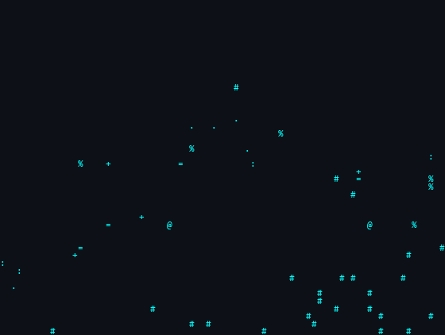

  <!-- Siberpunk ASCII Profil Fotoğrafı (EN TEPEYE EKLENDİ) -->
  
  
    
  
  <h1 align="center">Görkem Yiğit Memiş</h1>
  
  <!-- Siberpunk Daktilo Efekti -->
  

    
  

 

  <h3>👤 System Identity (Hakkımda)</h3>
  

    <i>"Sıradan mimarilerle sınırları aşamazsın."</i>   
    Büyük veri tabanı mimarilerinden <b>(Oracle SQL)</b>, mobil ekosistemdeki uç nokta yapay zeka entegrasyonlarına <b>(Local LLM, TypeScript)</b> ve kurumsal mimari tasarımına <b>(Java)</b> kadar uzanan geniş bir yelpazede yüksek performanslı sistemler inşa eden bir yazılım mühendisiyim. Özellikle mobil cihazlarda donanım seviyesinde çalışan yapay zeka (AI) çözümleri, karmaşık veritabanı analiz motorları ve kurumsal bankacılık sistemleri üzerinde çalışıyor, mimari darboğazları (bottleneck) tespit edip yok etmeyi bir yaşam tarzı olarak benimsiyorum. Yazdığım kodlar yapay zeka devrimiyle doğrudan iletişim kurar ve terminalin soğukluğunda şekillenir.
  

 

---

 

### 🚀 Deployed Architectures (Öne Çıkan Projelerim)

> *Sistem kaynaklarını son damlasına kadar sömüren, mimarisi ustalıkla örülmüş otonom sistemler.*

  
<b>🧠 LocalLLMios & AIPA Mobile Architecture</b>

   
  <code>TypeScript</code> ve <code>Swift/iOS</code> kullanılarak geliştirilmiş, mobil cihazlar üzerinde lokal Yapay Zeka (LLM) modellerini çalıştırabilen devasa otonom mobil sistem altyapısı. Bulut sunuculara ihtiyaç duymadan, doğrudan Apple Neural Engine ve cihaz donanımını sömürerek milisaniyeler içinde akıl yürütebilen devrimsel yapay zeka asistanları ağı.
    
    

  
<b>🏦 Enterprise Banking Core & API Simulation (gorkemBank)</b>

   
  <code>Java</code> ve <code>Oracle SQL</code> mimarisi üzerine inşa edilmiş, ultra-yüksek erişilebilirlik (high availability) prensiplerine sadık kalınarak tasarlanmış kurumsal bankacılık çekirdeği (Core Banking). Milyonlarca eşzamanlı finansal işlemi (transaction) saniyeler içinde hatasız yönetebilecek şekilde kurgulanmış; katı ACID kuralları, kriptografik veri güvenliği ve inanılmaz karmaşık (PL/SQL) finansal prosedürler içerir.
    
    

  
<b>🤖 SQL AI Intelligence System (sqlAI)</b>

   
  <code>Python</code> kullanılarak tasarlanmış, geleneksel veritabanı sorgularını yapay zeka ile entegre eden otonom veri analiz motoru. Karmaşık veritabanı yığınlarını saniyeler içinde okuyup analiz eden, insan müdahalesi olmadan akıllı optimizasyonlar ve derinlemesine içgörüler sunan Neural Network destekli veritabanı komuta merkezi.
    
   

 

---

 

### 🏢 Corporate Uplinks (Deneyimlerim)

| 🟢 Rol | 🏢 Kurum | 🛠️ Tech Stack | 🛡️ Operasyon Detayı |
|:---|:---|:---|:---|
| **Full Stack Software Engineer Intern** | **General Mobile** |   | Kurumsal web uygulamalarının inşası, backend-frontend veri akışının minimize edilmesi ve verimli RESTful API tasarımlarının yapılması. |
| **Software Intern** | **QNB Finansbank** |   | Dev finansal veritabanı mimarilerinin analizi, yavaş çalışan kompleks sorguların (query tuning) optimize edilmesi ve güvenli veri yönetimi operasyonları. |

 

---

 

  ### 🛠️ Cybernetics & Arsenal
  

    
    
    
    
    
    
  

   

  ### 📊 Neural Network Activity
  

    
    
  

   

  ### 🐍 Mainframe Data Eater (Contribution Snake)
  <picture>
    <source media="(prefers-color-scheme: dark)" srcset="https://raw.githubusercontent.com/gorkemyigitmemis/gorkemyigitmemis/output/github-contribution-grid-snake-dark.svg">
    <source media="(prefers-color-scheme: light)" srcset="https://raw.githubusercontent.com/gorkemyigitmemis/gorkemyigitmemis/output/github-contribution-grid-snake.svg">
    
  </picture>

   
   

  

